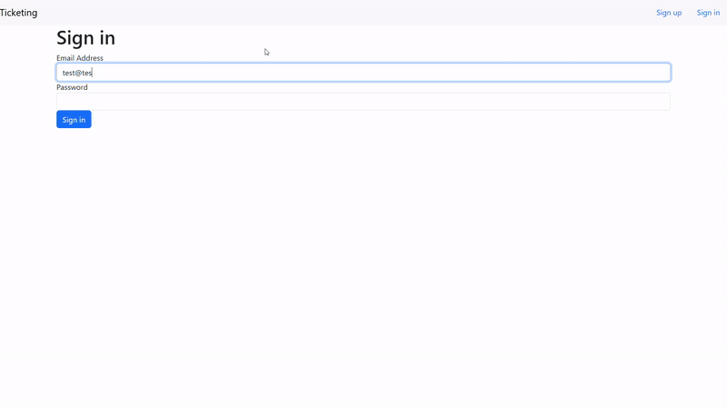

# Ticketing

A demo microservices project using docker, kubernetes and skaffold consisting of several different services.

-   **Auth Service**: Responsible for authentication and authorization usnig JWTs.
-   **Client Service**: The Next.js app .
-   **Expiration Service**: Responsible for notifying other services that the lock on a ticket being purchased has expired. When a user proceeds to payment, the ticket gets locked for a short amount of time to prevent it from being purchased by several users at the same time.
-   **Orders Service**: Responsible for managing users' orders.
-   **Payments Service**: Responsible for handling payment requests with stripe.
-   **Tickets Service**: Responsible for managing tickets.

## Built with:

-   Next.js
-   Express.js
-   MongoDB
-   Redis
-   Stripe
-   Nats
-   Ingress Nginx
